# IsCoolGPT
 
**_IsCoolGPT_** é um assistente de estudos focado em pessoas da área de tecnologia (desenvolvedores, designers, agilistas, produto, dados etc.), construído para a AV2 da disciplina de **Cloud Computing** utilizando:
 
- **FastAPI** como backend
- **Ollama + modelo gemma3:1b** rodando localmente
- **ngrok** para expor o Ollama para a internet
- **Docker e Docker Compose** para containerização
- **GitHub Actions + branch protection rules** para CI/CD
- Deploy em **Render** usando a imagem Docker / repositório GitHub

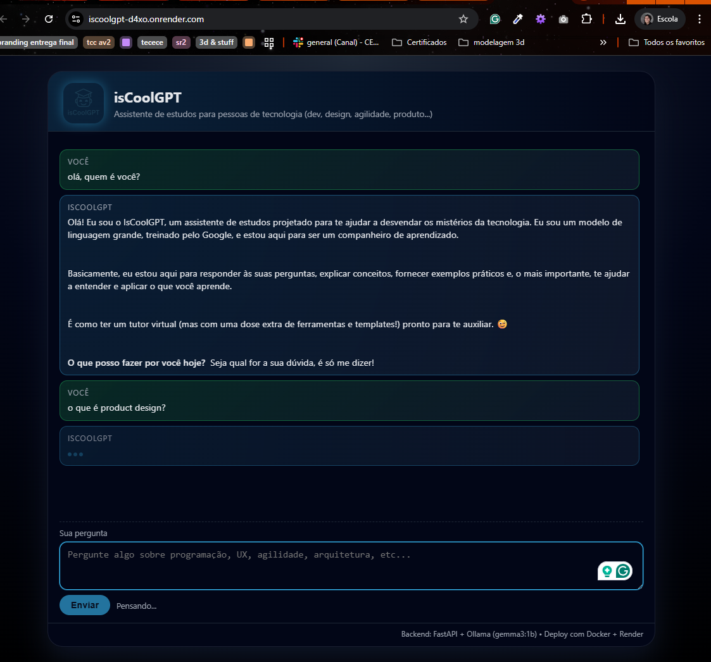

---

## 1. Visão geral do projeto

Vídeo de Explicação e Execução do Projeto: https://drive.google.com/drive/folders/1kTFFpC2_rM-4vKa8E4_cHo7_bJwv_TLP?usp=sharing

**Objetivo pedagógico:**  
Demonstrar entendimento prático de conceitos de Cloud Computing através de uma aplicação real que:

- consome um **LLM local (Ollama)** exposto via ngrok;
- é empacotada em **containers Docker**;
- utiliza **CI/CD** com GitHub Actions (testes, build de imagem, auto-PR, auto-merge);
- faz deploy em um **PaaS (Render)**;
- aplica **boas práticas de arquitetura**, separando camadas e usando variáveis de ambiente.

**Objetivo funcional:**  
Ser um assistente de estudos que:

- responde dúvidas sobre temas de tecnologia;
- explica conceitos em diferentes níveis de profundidade;
- sugere exercícios e exemplos práticos;
- usa um prompt de sistema próprio (`SYSTEM_PROMPT`) para guiar o comportamento do modelo.

"_E como isso tudo se conecta com Cloud Computing?_"

* FastAPI + Docker → empacotamento da aplicação para rodar em qualquer infraestrutura (IaaS ou PaaS).
* Render → exemplo de PaaS (infra, rede, orquestração, logs, etc. gerenciados pelo provedor).
* ngrok + Ollama local → cenário de cloud híbrida / edge: aplicação em cloud consumindo recurso que está on-premises (minha máquina local).
* GitHub Actions → CI/CD como serviço gerenciado.
* Branch protection → governança de código e segurança de mudanças em ambientes de produção.

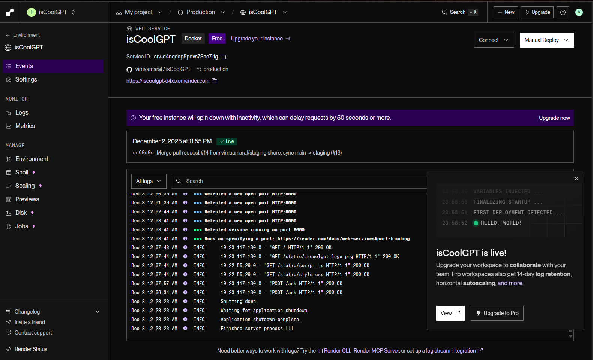


---

## 2. Arquitetura geral

### 2.1 Fluxo de alto nível

- **Ambiente local (Docker Compose)**  
  `Navegador → container iscoolgpt-api (FastAPI) → http://host.docker.internal:11434 → Ollama (gemma3:1b) no Windows`

- **Ambiente de produção (Render)**  
  `Navegador → serviço FastAPI no Render → OLLAMA_BASE_URL (URL do ngrok) → Ollama (gemma3:1b) no Windows`

### 2.2 Diagrama simplificado

```text
Usuário (Estudante)
        |
        v
 Navegador (HTML/JS - app/static)
        |
        v
 Backend FastAPI (app/main.py)
        |
        v
 Cliente Ollama (app/services/ollama_client.py)
        |
        v
Ollama (gemma3:1b) via HTTP
- Localhost (dev)
- host.docker.internal (Docker Compose)
- URL ngrok (Render)
```

---

## 3. Arquitetura da aplicação

### 3.1 Backend (FastAPI)

**Arquivo principal:** `app/main.py`

**Responsabilidades:**

- **Servir a interface web:**
  - `GET /` – lê e retorna `app/static/index.html`.
  - `/static/*` – serve JS, CSS e logo via `StaticFiles`.

- **Expor a API:**
  - `GET /health` – endpoint de health check (usado para monitoramento e CI).
  - `POST /ask` – recebe uma `QuestionRequest` e retorna um `AnswerResponse`.

- **Configurar CORS:**
  - Usa `CORSMiddleware` com:
    - `allow_origins=["*"]`
  - Permite que o frontend e outros clientes consumam o endpoint `/ask` sem problemas de CORS.


### 3.2 Modelos de dados (Pydantic)

**Arquivo:** `app/schemas.py`

- **`QuestionRequest`**
  - `question: str` → pergunta do estudante (obrigatória).

- **`AnswerResponse`**
  - `answer: str` → resposta do modelo.
  - `model: str` → nome do modelo utilizado (ex.: `"gemma3:1b"`).
  - `source: str = "ollama"` → origem da resposta.


### 3.3 Configuração via ambiente

**Arquivo:** `app/config.py`

- **`OLLAMA_BASE_URL`**
  - URL do servidor Ollama.
  - Exemplos:
    - `http://localhost:11434`
    - `http://host.docker.internal:11434`
    - `https://renae-paly-so.ngrok-free.dev`

- **`OLLAMA_MODEL`**
  - Nome do modelo utilizado.
  - Exemplo: `gemma3:1b`.

- **`SYSTEM_PROMPT`**
  - Prompt de sistema que define a “personalidade” do IsCoolGPT como tutor de tecnologia.

> Todos esses valores podem ser sobrescritos via variáveis de ambiente, permitindo ajustar o comportamento por ambiente (dev, Docker, Render, etc.).

### 3.4 Integração com o Ollama

**Arquivo:** `app/services/ollama_client.py`

- **Função:** `ask_ollama(question: str) -> str`

  Responsabilidades:

  - Monta a URL: `OLLAMA_BASE_URL + "/api/chat"`.
  - Envia um payload no formato de chat do Ollama:
    - `model`
    - `stream: false`
    - mensagens `system` (com `SYSTEM_PROMPT`) e `user` (pergunta).
  - Usa `httpx.AsyncClient` com timeout de 30 segundos.
  - Em caso de erro HTTP ou resposta fora do formato esperado:
    - lança uma exceção `OllamaError`.
  - Retorna apenas o texto `message.content` da resposta do modelo.

No endpoint `POST /ask` (em `app/main.py`), qualquer `OllamaError` é convertido em um `HTTP 502 Bad Gateway`, deixando claro que a falha ocorreu na comunicação com o serviço externo (Ollama).

### 3.5 Frontend (HTML + CSS + JS)

**Pasta:** `app/static/`

- **`index.html`**  
  Interface de chat simples, contendo:
  - área de mensagens;
  - campo de texto (textarea) para a pergunta;
  - botão de envio;
  - seção de status (ex.: “Pensando…”).

- **`style.css`**  
  Define um layout moderno, com:
  - diferenciação visual entre mensagens de usuário e de assistente;
  - balão de “digitando…” para o isCoolGPT;
  - responsividade básica.

- **`script.js`**  
  Responsável por:

  - capturar o `submit` do formulário;
  - enviar a pergunta para `/ask` via `fetch` (`POST` com JSON `{ question }`);
  - mostrar a mensagem do usuário na tela;
  - exibir um indicador de “isCoolGPT digitando…” enquanto a resposta não chega;
  - renderizar um subset de Markdown (títulos, listas, **negrito**, *itálico*) de forma segura (escapando HTML antes);
  - permitir:
    - **Enter** para enviar a mensagem;
    - **Shift+Enter** para inserir quebra de linha no textarea.

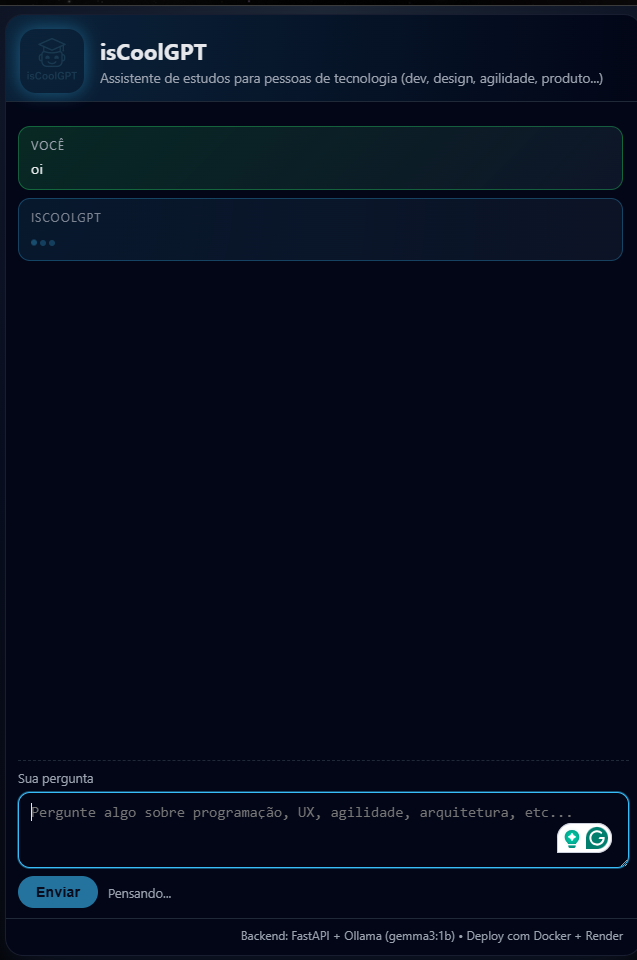

---
## 4. Configuração de ambiente

### 4.1 Variáveis de ambiente da aplicação

As principais variáveis de ambiente usadas pela aplicação (definidas em `app/config.py`) são:

- **`OLLAMA_BASE_URL`**
  - URL base do servidor Ollama.
  - Exemplos:
    - `http://localhost:11434`
    - `http://host.docker.internal:11434`
    - `https://renae-paly-so.ngrok-free.dev` (URL do ngrok)

- **`OLLAMA_MODEL`**
  - Nome do modelo utilizado pelo Ollama.
  - Exemplo: `gemma3:1b`.

- **`SYSTEM_PROMPT`**
  - Prompt de sistema que define a “personalidade” do IsCoolGPT como tutor de tecnologia.
  - Pode ser sobrescrito para focar o assistente em um tema específico (ex.: só Cloud Computing).

Essas variáveis podem ser configuradas de forma diferente em cada ambiente (desenvolvimento local, Docker, Render, etc.), sem necessidade de alterar o código.

**Exemplo (Linux/macOS):**

```bash
export OLLAMA_BASE_URL="https://renae-paly-so.ngrok-free.dev"
export OLLAMA_MODEL="gemma3:1b"
export SYSTEM_PROMPT="Você é um tutor focado na área de TI..."
uvicorn app.main:app --host 0.0.0.0 --port 8000
```

### 4.2 CORS do Ollama (ponto crítico)

> No início, ao tentar consumir o Ollama a partir do backend (Docker/Render) via ngrok, eu recebia 403 Forbidden. Descobri que o Ollama aplica política de CORS e, por padrão, bloqueia origens externas. A solução foi iniciar o serviço com as variáveis OLLAMA_HOST e OLLAMA_ORIGINS configuradas, liberando o acesso de outros hosts (Docker e Render) e corrigindo o problema de autorização.

Para que o backend (rodando localmente, em Docker ou no Render) consiga chamar o Ollama sem receber erro `403 Forbidden`, foi necessário abrir o **CORS do Ollama**.

No Windows (PowerShell), em cada nova sessão de terminal, antes de rodar `ollama serve`, é preciso configurar:

```bash
$env:OLLAMA_HOST    = "0.0.0.0:11434"
$env:OLLAMA_ORIGINS = "*"
ollama serve
```

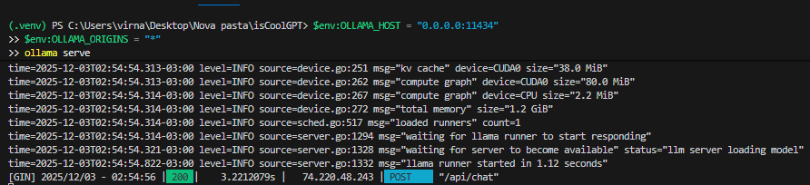

* `OLLAMA_HOST = "0.0.0.0:11434"`: Faz o Ollama escutar em todas as interfaces de rede na porta 11434 (não só em localhost).
* `OLLAMA_ORIGINS = "*"`: Libera CORS para qualquer origem, permitindo que:
   * o container Docker (host.docker.internal);
   * o Render (via URL do ngrok);
   * e outros clientes HTTP autorizados consigam chamar a API do Ollama sem bloqueio de CORS.

> Importante: variáveis definidas com `$env:` no PowerShell valem apenas para aquele terminal.
Sempre que você abrir uma nova janela de PowerShell para rodar `ollama serve`, precisa exportar novamente `OLLAMA_HOST` e `OLLAMA_ORIGINS`.

---

## 5. ngrok + Ollama

Para que a aplicação em Cloud consiga acessar o modelo que está rodando **localmente no computador via Ollama**, foi usado o **ngrok** para expor o serviço HTTP do Ollama na internet.

### 5.1 Passo a passo

1. *Iniciar o Ollama com CORS habilitado*
2. *Rodar o ngrok apontando para a porta do Ollama (11434):*

   ```powershell
   ngrok http 11434
   ```
3. *Copiar a URL HTTPS gerada pelo ngrok (ex.: https://meu-tunel.ngrok-free.app)*
4. *Definir `OLLAMA_BASE_URL` na aplicação (local ou no Render) como essa URL.*


## 6. Containerização (Docker e Docker Compose)

### 6.1 Dockerfile (multi-stage)

A aplicação utiliza um `Dockerfile` com **dois estágios**, para reduzir o tamanho da imagem e aproveitar melhor cache de dependências:

1. **Stage 1 – builder**
   - Base: `python:3.11-slim`.
   - Define variáveis para evitar criação de `.pyc` e melhorar logs (`PYTHONDONTWRITEBYTECODE`, `PYTHONUNBUFFERED`).
   - Instala dependências de sistema mínimas necessárias, como `build-essential`.
   - Copia `requirements.txt` para dentro da imagem.
   - Instala as dependências Python em um diretório separado (`/install`), que depois é reaproveitado no estágio final.

2. **Stage 2 – runtime**
   - Base: `python:3.11-slim` (limpa, sem ferramentas de build).
   - Copia as bibliotecas Python previamente instaladas em `/install` para `/usr/local`.
   - Define `WORKDIR /app`.
   - Copia o código da aplicação:
     - pasta `app/`
     - `requirements.txt`
     - `README.md`
   - Expõe a porta `8000`.
   - Define variáveis de ambiente padrão, como:
     - `OLLAMA_BASE_URL`
     - `OLLAMA_MODEL`
   - Comando de entrada:
     - Servidor Uvicorn rodando `app.main:app` em `0.0.0.0:8000`.


### 6.2 Docker Compose (desenvolvimento local)

Para facilitar o desenvolvimento local, foi criado um arquivo `docker-compose.yml` com um serviço principal:

- **Serviço `api`**
  - `container_name`: `iscoolgpt-api`.
  - `build: .` → utiliza o `Dockerfile` da raiz do projeto.
  - `ports`:
    - mapeia `8000:8000`, permitindo acessar a API em `http://localhost:8000`.
  - `environment`:
    - `OLLAMA_BASE_URL: "http://host.docker.internal:11434"`
      - Isso permite que o container acesse o Ollama que está rodando no host Windows, usando o host especial `host.docker.internal`.
    - `OLLAMA_MODEL: "gemma3:1b"`.
  - `restart: unless-stopped`:
    - o container é reiniciado automaticamente caso caia, até que seja explicitamente parado.

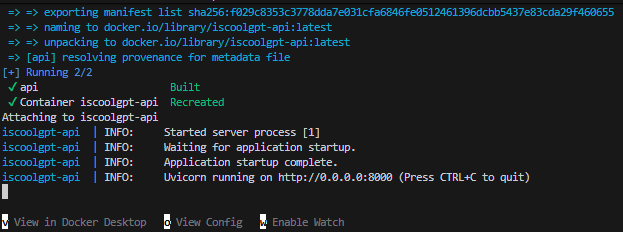


### 6.3 Passos para rodar com Docker Compose

1. **Garantir que o Ollama está rodando com CORS habilitado no host**

   - No PowerShell, antes de subir os containers:
     - Definir `OLLAMA_HOST` para `0.0.0.0:11434`.
     - Definir `OLLAMA_ORIGINS` para `"*"`.
     - Rodar `ollama serve`.
   - O Ollama passa a ficar acessível a partir do container via `http://host.docker.internal:11434`.

2. **Build e subida dos containers**

   - A partir da pasta do projeto, executar:
     - `docker compose up --build`
   - O Docker fará:
     - build da imagem multi-stage;
     - criação e inicialização do container `iscoolgpt-api`.

3. **Acessar a aplicação**

   - Após os containers subirem com sucesso:
     - acessar `http://localhost:8000` no navegador.
   - A interface web (`index.html`) será servida pelo backend FastAPI, e as requisições a `/ask` serão encaminhadas para o Ollama via `OLLAMA_BASE_URL`.

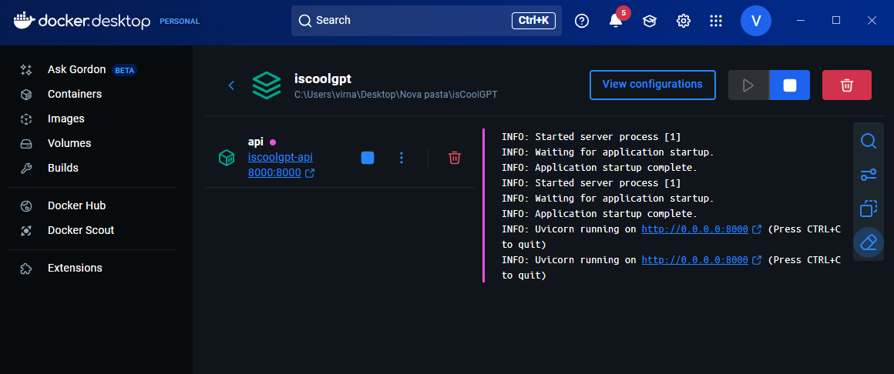

---


## 7. CI/CD com GitHub Actions

A automação de testes, build e sincronização entre branches é feita com **GitHub Actions**, usando três workflows principais na pasta `.github/workflows`:

- `ci.yml`
- `auto-pr-main-to-staging.yml`
- `automerge-staging.yml`


### 7.1 Workflow de CI – `ci.yml`

O workflow de CI é responsável por:

- executar os testes automatizados (pytest);
- garantir que o projeto builda corretamente em uma imagem Docker;
- atuar como **status check obrigatório** nas branches protegidas (`staging` e `production`).

**Disparo (triggers):**

- Em `push` para as branches:
  - `main`
  - `staging`
  - `production`
- Em `pull_request` com destino para:
  - `main`
  - `staging`
  - `production`

**Job principal: `test-and-build`**

- `runs-on: ubuntu-latest`
- Passos:
  - checkout do repositório (action `actions/checkout@v4`);
  - configuração do Python 3.11 (action `actions/setup-python@v5`);
  - instalação das dependências a partir de `requirements.txt`;
  - execução dos testes com `pytest -q`;
  - build da imagem Docker com `docker build -t iscoolgpt-backend .`.

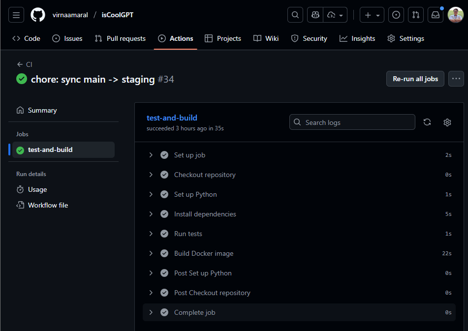

Esse job gera o status `test-and-build`, que é exigido pelos rulesets de branch antes de permitir qualquer merge em `staging` ou `production`.

### 7.2 Auto PR `main → staging` – `auto-pr-main-to-staging.yml`

Esse workflow automatiza a criação de Pull Requests para manter `staging` sincronizada com a `main`.

**Disparo:**

- Em `push` na branch `main`.

**Job `create-pr`:**

- `runs-on: ubuntu-latest`
- Permissões:
  - `contents: read`
  - `pull-requests: write`

**Funcionamento:**

1. Verifica, via API do GitHub, se já existe um Pull Request aberto de `main` para `staging`.
   - Usa `curl` e `jq` para consultar a rota de PRs:
     - endpoint `/repos/{owner}/{repo}/pulls?state=open&base=staging&head={owner}:main`.
   - Conta quantos PRs abertos existem (`open_prs`).

2. Se **não existir** PR (`open_prs == 0`), cria automaticamente um PR:
   - título: algo como `chore: sync main -> staging`;
   - base: `staging`;
   - head: `main`;
   - corpo explicando que o PR foi criado automaticamente para sincronização.

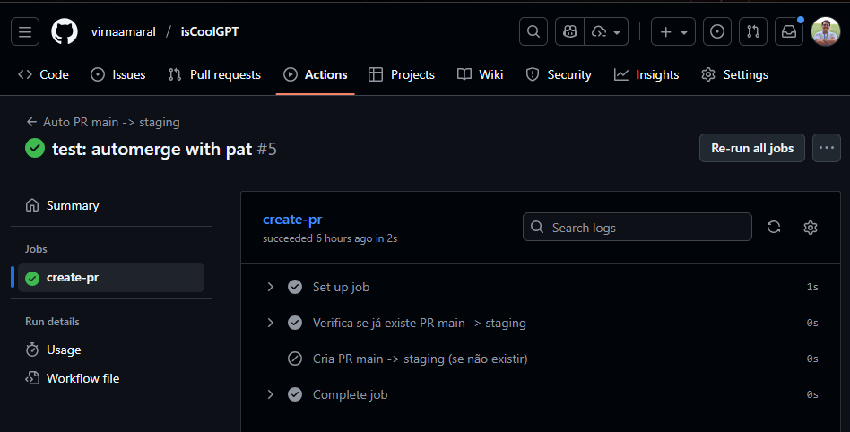

Isso garante que qualquer novo commit em `main` gera (ou reutiliza) um PR para `staging` sem intervenção manual.


### 7.3 Auto-merge `main → staging` – `automerge-staging.yml`

Esse workflow complementa o anterior: ele **habilita o auto-merge** para PRs de `main` para `staging`, permitindo que o GitHub finalize o merge sozinho assim que o CI estiver verde e todas as regras forem cumpridas.

**Disparo:**

- Em eventos de `pull_request` na branch `staging`, para os tipos:
  - `opened`
  - `reopened`
  - `synchronize`
  - `ready_for_review`

**Escopo de permissões:**

- `contents: read`
- `pull-requests: read`  
  (o token real de escrita vem via `PAT_AUTOMERGE` nos inputs da action.)

**Condição do job `enable-automerge`:**

- Só roda se:
  - `github.event.pull_request.base.ref == 'staging'`
  - e `github.event.pull_request.head.ref == 'main'`

Ou seja, apenas PRs `main → staging` são afetados.

**Passo principal:**

- Usa a action `peter-evans/enable-pull-request-automerge@v3` com:
  - `token: ${{ secrets.PAT_AUTOMERGE }}`
  - `pull-request-number: ${{ github.event.pull_request.number }}`
  - `merge-method: squash`
  - `commit-title: 'chore: sync main -> staging'`

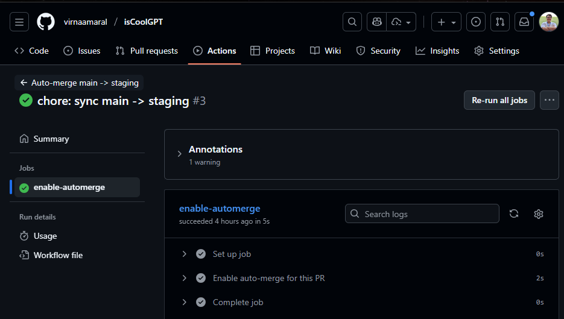

**Integração com branch protection:**

- O auto-merge **não ignora** as regras de proteção:
  - o PR só é efetivamente mergeado quando:
    - o workflow de CI (`test-and-build`) estiver concluído com sucesso;
    - todas as demais exigências do ruleset da branch `staging` forem atendidas.

Isso cria um fluxo em que:

1. `main` recebe novos commits;
2. o CI roda;
3. um PR automático `main → staging` é criado (se ainda não existir);
4. o workflow de auto-merge habilita o auto-merge para esse PR;
5. o GitHub aguarda o CI ficar verde e, então, faz o merge automaticamente em `staging`.

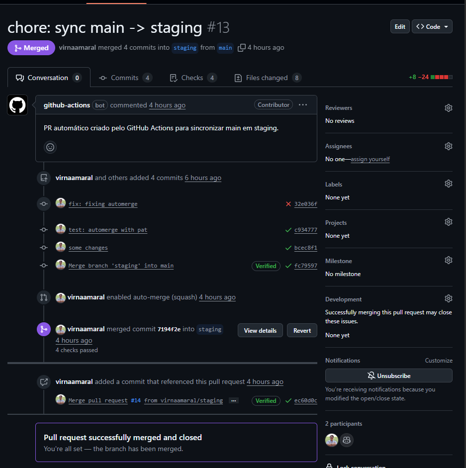

---

## 8. Proteção de branches e segurança no GitHub

Para garantir a segurança das branches mais críticas do projeto, foram configurados **rulesets** específicos para as branches `staging` e `production`.

### 8.1 Regras aplicadas às branches `staging` e `production`

As principais proteções são:

- **Obrigação de Pull Request para qualquer mudança**
  - Não é permitido fazer merge direto nas branches `staging` e `production`.
  - Toda alteração precisa passar por um PR.
   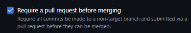

- **Proibição de push direto e push com `--force`**
  - Impede que alguém sobrescreva o histórico dessas branches criticamente importantes.
  - Garante um histórico mais confiável e auditável.
   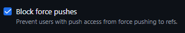
- **Deleção de branch apenas com permissões elevadas**
  - Evita que `staging` ou `production` sejam apagadas acidentalmente.
   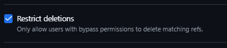
- **Status check obrigatório**
  - O status do workflow de CI (`test-and-build`) precisa estar **verde** para que um PR seja mergeado em `staging` ou `production`.
  - Isso garante que apenas código testado e buildado chegue nesses ambientes.
   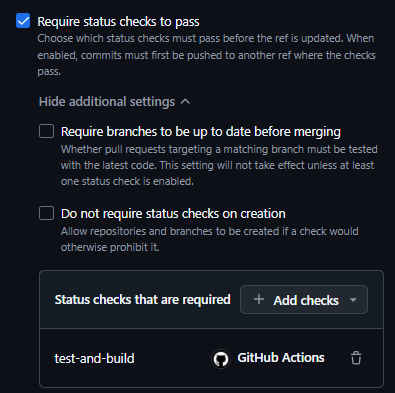

### 8.2 Requisitos para o auto-merge funcionar

Para que o fluxo automático de sincronização `main → staging` funcione corretamente, foram feitas as seguintes configurações adicionais:

- **Personal Access Token (PAT)**
  - Foi criado um PAT com permissões adequadas de acesso ao repositório.
  - Esse token foi salvo como secret no repositório com o nome `PAT_AUTOMERGE`.
  - Ele é utilizado pelo workflow `automerge-staging.yml` para habilitar o auto-merge via API do GitHub.
   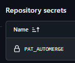


- **Configurações do repositório**
  - O repositório foi configurado para:
    - **Permitir auto-merge** em Pull Requests.
    - Permitir o tipo de merge usado pelo workflow (no caso, `squash`).
   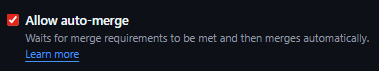

- **Permissões do GitHub Actions**
  - Na aba **Actions**, o GitHub Actions foi autorizado a:
    - ter permissões de **leitura e escrita**;
    - **criar e aprovar PRs** em nome do bot do GitHub.
Essas configurações permitem que o bot/GitHub Actions consiga:
- abrir PRs automaticamente;
- habilitar o auto-merge para eles;
- respeitar as regras de proteção definidas nos rulesets.
   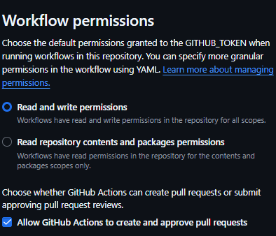


### 8.3 Fluxo final de promoção de código

O fluxo completo de promoção de código entre as branches fica assim:

1. **Desenvolvedor faz push na `main`.**
2. O **CI** é disparado e roda o workflow `test-and-build`.
3. O workflow `auto-pr-main-to-staging.yml` verifica se já existe PR de `main` para `staging`:
   - se não existir, cria automaticamente um PR `main → staging`.
4. O workflow `automerge-staging.yml` habilita o **auto-merge** para esse PR, usando o PAT configurado.
5. Quando:
   - o CI (`test-and-build`) estiver verde; e
   - todas as regras do ruleset da branch `staging` forem satisfeitas;  
   o GitHub realiza o **merge automático** do PR para `staging`.
6. A promoção de `staging` para `production` é feita **manualmente**, como uma camada extra de segurança e revisão final.

Aqui está um fluxograma que elucida as informações de forma visual:

```text

                 ┌─────────────────────┐
                 │   Dev faz push      │
                 │     na branch       │
                 │        main         │
                 └─────────┬───────────┘
                           │
                           v
                 ┌─────────────────────┐
                 │  GitHub Actions     │
                 │   roda CI (CI.yml)  │
                 │  job: test-and-build│
                 └─────────┬───────────┘
                           │
                 CI passou?│
                   (OK?)   │
              ┌────────────┴────────────┐
              │                         │
              v                         v
   ┌─────────────────────┐    ┌─────────────────────┐
   │ Workflow cria/usa   │    │   CI falhou         │
   │ PR main → staging   │    │ (sem merge em       │
   │ (auto-pr-main-      │    │  staging/production)│
   │   -to-staging.yml)  │    └─────────────────────┘
   └─────────┬───────────┘
             │  PR aberto/atualizado
             v
   ┌────────────────────────────┐
   │ Workflow habilita          │
   │ auto-merge no PR           │
   │ (automerge-staging.yml     │
   │  + PAT_AUTOMERGE)          │
   └─────────┬──────────────────┘
             │
   Regras da │ staging ok?
 (CI green + │ ruleset, sem
  proteções) │ bloqueios?
      ┌──────┴───────────┐
      │                  │
      v                  v
┌─────────────────┐   ┌─────────────────────┐
│ GitHub realiza  │   │  Aguardando CI ou   │
│ auto-merge do   │   │  ajustes no PR      │
│ PR em staging   │   └─────────────────────┘
└─────────┬───────┘
          │
          v
┌───────────────────────────────┐
│  Código consolidado em        │
│          staging              │
│ (ambiente intermediário)      │
└─────────┬─────────────────────┘
          │
          │  PR manual
          │  staging → production
          v
┌───────────────────────────────┐
│  Revisão manual e merge em    │
│         production            │
│ (última camada de segurança   │
│    antes do ambiente final)   │
└───────────────────────────────┘
```

> Essas regras simulam o que acontece em ambientes de produção reais, onde não é aceitável que qualquer desenvolvedor faça push direto na branch de produção. A combinação de CI obrigatório, PRs, auto-merge controlado e promoção manual de staging para production cria uma trilha auditável e reduz o risco de deployments quebrados.

---

## 9. Estrutura de Diretórios
```bash
ISCOOLGPT
|-- .github
|   |-- workflows
|   |   |-- auto-pr-main-to-staging.yml
|   |   |-- automerge-staging.yml
|   |   |-- ci.yml
|
|-- app
|   |-- main.py             # aplicação FastAPI (rotas / API)
|   |-- config.py           # configuração via variáveis de ambiente
|   |-- schemas.py          # modelos Pydantic (request/response)
|   |-- services
|   |   |-- __init__.py
|   |   |-- ollama_client.py  # integração com Ollama (HTTP)
|   |
|   |-- static
|       |-- index.html      # interface web (chat)
|       |-- script.js       # lógica do frontend
|       |-- style.css       # estilos
|       |-- iscoolgpt-logo.png
|
|-- tests
|   |-- __init__.py
|   |-- test_api.py         # testes automatizados (pytest)
|
|-- .dockerignore
|-- .gitignore
|-- docker-compose.yml
|-- Dockerfile
|-- LICENSE
|-- README.md
|-- requirements.txt

```
---

## 10. Como Rodar o Projeto

**Pré-requisitos:**

1. Ollama instalado e modelo gemma3:1b baixado.
2. ngrok instalado e autenticado.
3. Docker instalado.
4. Conta no Render configurada e repositório conectado (para produção).

>PS: O link ativo na descrição deste repositório é o link de produção.

### 10.1 Sem Docker
1. Ativar ambiente virtual e instalar dependências:
```bash
pip install -r requirements.txt
```
2. Iniciar o Ollama com CORS (Windows/PowerShell):
```bash
$env:OLLAMA_HOST    = "0.0.0.0:11434"
$env:OLLAMA_ORIGINS = "*"
ollama serve
```
3. Rodar modelo:
```bash
ollama run gemma3:1b
```
4. Rodar o backend:
```bash
uvicorn app.main:app --host 0.0.0.0 --port 8000
```
5. Acessar: `http://localhost:8000`

### 10.2 Com Docker Compose

1. Iniciar o Ollama com CORS (Windows/PowerShell):
```bash
$env:OLLAMA_HOST    = "0.0.0.0:11434"
$env:OLLAMA_ORIGINS = "*"
ollama serve
```
2. Rodar:
```bash
docker compose up --build
```
3. Acessar: `http://localhost:8000`

### 10.3 Em Produção (Render + ngrok)
1. Iniciar o Ollama com CORS (Windows/PowerShell):
```bash
$env:OLLAMA_HOST    = "0.0.0.0:11434"
$env:OLLAMA_ORIGINS = "*"
ollama serve
```
2. Subir o ngrok:
```bash
ngrok http 11434
```
3. Pegar a URL HTTPS do ngrok e configurar como OLLAMA_BASE_URL nas variáveis de ambiente do serviço no Render.
4. Conectar o Render ao repositório GitHub, apontando para a branch production e usando Dockerfile.

5. Render inicia o container, que consome o LLM via ngrok.

---

## 11. Testes
Os testes automatizados estão em `tests/test_api.py` e são executados pelo workflow de CI:
```bash
pytest -q
```
Nesses testes, são feitas verificações para checar se:
   * o endpoint /health responde 200 e retorna o JSON esperado.
   * o endpoint /ask simulando uma pergunta, o formato da resposta é validado
      * (por exemplo, se a pergunta é "o que é Ollama?" um indicativo inicial para saber se a resposta está válida é se ela contém a palavra-chave).
   * se a pergunta enviada é uma string vazia.

O CI garante que os testes passem antes de qualquer merge em staging ou production, permitindo que o ambiente de produção permaneça íntegro.

---

## 12. Recap Geral e Próximos Passos
O IsCoolGPT é um assistente de estudos para tecnologia que junta um backend em FastAPI, um LLM local rodando via Ollama (gemma3:1b), exposição segura com ngrok, containerização com Docker/Docker Compose e um pipeline de CI/CD usando GitHub Actions, branch protection e deploy no Render. Na prática, ele simula um cenário bem real de cloud híbrida: a aplicação está em PaaS, mas o “cérebro” (modelo) continua rodando on-premises em uma máquina local.

Como próximos passos de melhoria poderiam ser:

* Arquitetura / Cloud

   * Migrar o modelo para um provedor gerenciado (ou um servidor próprio na nuvem) para não depender do PC + ngrok.

* Aplicação

   * Adicionar autenticação básica (API key / JWT) e rate limiting.
   * Guardar histórico de conversas e permitir “tópicos”/salas de estudo.
   * Implementar logs mais ricos (pergunta, tempo de resposta, erros do Ollama) e métricas simples.

* ML / LLM

   * Criar prompts “perfis” (ex.: foco em Cloud, foco em Python, foco em entrevistas).
   * Medir qualidade das respostas (ex.: testes automatizados com perguntas fixas).

* DevOps
   * Aumentar a cobertura de testes (unitário + integração).
   * Automatizar o fluxo staging → production com aprovações manuais (environments, reviewers, etc.).
